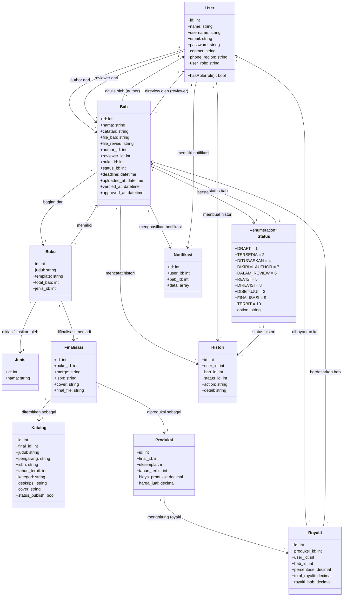

<h1 align="center">SIM Buku Ilmiah</h1>

<p align="center">
  Sistem Informasi Manajemen Penerbitan Buku Ilmiah — alur editorial terstruktur dari hulu ke hilir.
</p>

## Tentang

SIM Buku Ilmiah adalah aplikasi berbasis web untuk mengelola proses penerbitan buku ilmiah dengan alur editorial yang terkontrol. Aplikasi ini mencakup:

- Manajemen user dengan 3 peran: **Admin**, **Author**, **Reviewer**
- Pembuatan buku dan struktur bab
- Assignment author & reviewer ke bab oleh admin (bukan claim mandiri)
- Upload naskah, review, dan revisi
- Finalisasi buku dan katalog
- Produksi dan royalti

## Tech Stack

| Komponen | Teknologi |
|---|---|
| **Backend** | Laravel 11 (PHP ^8.1) |
| **Frontend** | Stisla (Bootstrap Admin Template) |
| **Database** | MySQL |
| **Deployment** | Docker (VPS EC2 AWS) |

## Class Diagram



## Struktur Model

### Domain Inti

| Model | Tabel | Deskripsi |
|---|---|---|
| `User` | `users` | Pengguna sistem dengan role `admin`, `author`, atau `reviewer` |
| `Buku` | `bukus` | Data buku ilmiah (judul, template, jumlah bab) |
| `Bab` | `babs` | Bab/chapter dalam buku — unit kerja utama editorial |
| `Status` | `statuses` | Status editorial yang merekam siklus hidup bab |
| `Jenis` | `jenis` | Kategori/jenis buku ilmiah |

### Domain Finalisasi & Publikasi

| Model | Tabel | Deskripsi |
|---|---|---|
| `Finalisasi` | `finalisasis` | Proses finalisasi buku (merge bab, ISBN, cover, file final) |
| `Katalog` | `katalogs` | Katalog publikasi buku yang sudah final |
| `Produksi` | `produksis` | Data produksi fisik buku (eksemplar, biaya, harga jual) |
| `Royalti` | `royaltis` | Perhitungan royalti per kontributor per bab |

### Domain Pendukung

| Model | Tabel | Deskripsi |
|---|---|---|
| `Histori` | `historis` | Riwayat aksi pada setiap bab (siapa melakukan apa, kapan) |
| `Notifikasi` | `notifikasis` | Notifikasi untuk user terkait perubahan status bab |

## Alur Editorial

### Status Transitions

```
                       ┌─────────────────┐
                       │     Draft (1)    │
                       └────────┬─────────┘
                                │
                       ┌────────▼─────────┐
                       │   Tersedia (2)    │
                       └────────┬─────────┘
                                │ Admin assign author & reviewer
                       ┌────────▼─────────┐
                       │  Ditugaskan (4)   │
                       └────────┬─────────┘
                                │ Author upload naskah
                       ┌────────▼─────────┐
                       │ Dikirim Author (7)│
                       └────────┬─────────┘
                                │
                       ┌────────▼─────────┐
                       │  Dalam Review (6) │
                       └──┬──────────────┬─┘
                          │              │
                 ┌────────▼──┐    ┌──────▼───────────┐
                 │ Revisi (5) │    │ Disetujui (3)    │
                 └────────┬───┘    └──────┬───────────┘
                          │              │
                 ┌────────▼───┐          │
                 │ Direvisi (8)│          │
                 └────────┬───┘          │
                          │              │
                          └──────┬───────┘
                                 │
                        ┌────────▼────────┐
                        │  Finalisasi (9)  │
                        └────────┬─────────┘
                                 │
                        ┌────────▼────────┐
                        │   Terbit (10)    │
                        └─────────────────┘
```

### Urutan Proses

| Langkah | Aksi | Pelaku | Status Baru |
|---|---|---|---|
| 1 | Membuat buku & struktur bab | Admin | — |
| 2 | Membuat bab baru | Admin | `Draft` → `Tersedia` |
| 3 | Assign author & reviewer | Admin | `Ditugaskan` |
| 4 | Upload naskah bab | Author | `Dikirim Author` |
| 5 | Upload review & catatan | Reviewer | `Dalam Review` |
| 6a | Minta revisi | Reviewer | `Revisi` |
| 6b | Upload revisi | Author | `Direvisi` → kembali ke #5 |
| 7 | Setujui bab | Reviewer/Admin | `Disetujui` |
| 8 | Merge & finalisasi buku | Admin | `Finalisasi` |
| 9 | Publikasi katalog | Admin/System | `Terbit` |

## Role & Hak Akses

### Admin

| Area | Akses |
|---|---|
| **User** | CRUD semua user |
| **Buku** | CRUD buku, struktur bab |
| **Assignment** | Assign author & reviewer ke bab |
| **Review** | Lihat semua buku, bab, file, catatan, histori |
| **Finalisasi** | Merge bab (jika semua sudah Disetujui), upload ISBN/cover/final |
| **Katalog** | Buat katalog setelah finalisasi |
| **Produksi** | Buat data produksi |
| **Royalti** | Buat perhitungan royalti |

### Author

| Area | Akses |
|---|---|
| **Buku & Bab** | Lihat hanya yang ditugaskan kepadanya |
| **Upload** | Upload naskah bab untuk tugasnya sendiri |
| **Revisi** | Upload revisi jika status meminta revisi |
| **Catatan** | Lihat catatan reviewer untuk babnya |
| **Larangan** | Tidak bisa claim bab sendiri, tidak bisa upload untuk author lain |

### Reviewer

| Area | Akses |
|---|---|
| **Buku & Bab** | Lihat hanya yang ditugaskan kepadanya |
| **Download** | Unduh naskah bab yang sudah dikirim author |
| **Review** | Upload file review, isi catatan, beri keputusan |
| **Keputusan** | `Revisi` atau `Direkomendasikan Disetujui` |
| **Larangan** | Tidak bisa review bab yang tidak ditugaskan, tidak ubah author/struktur |

## Prasyarat

- PHP ^8.1
- Composer
- MySQL
- Node.js & NPM

## Instalasi

```bash
git clone https://github.com/dioproject/SIM_BUKU_ILMIAH.git
cd SIM_BUKU_ILMIAH
composer install
npm install
cp .env.example .env
php artisan key:generate
php artisan migrate --seed
php artisan serve
```

## Testing

```bash
php artisan test
```

## Aturan Commit

Commit message singkat dan jelas, misalnya:

- `Refactor chapter workflow to admin assignments`
- `Add editorial status workflow`
- `Restrict reviewer access to assigned chapters`
- `Validate chapter finalization readiness`

## Lisensi

[MIT](LICENSE)
