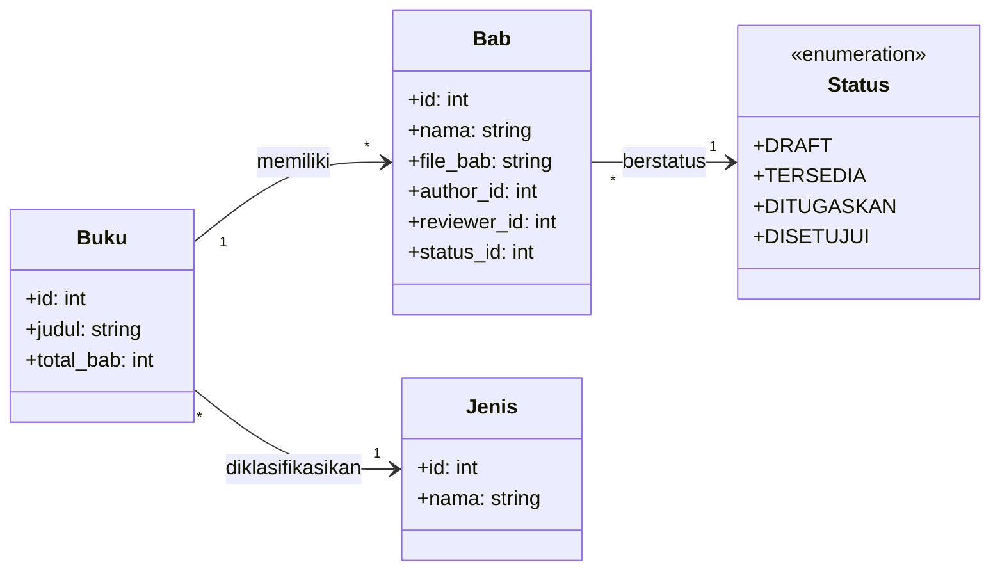
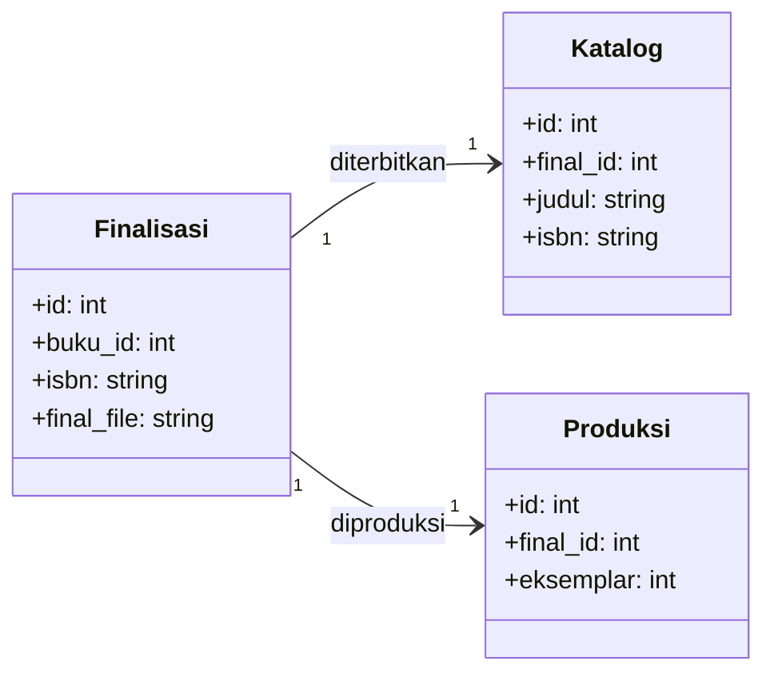
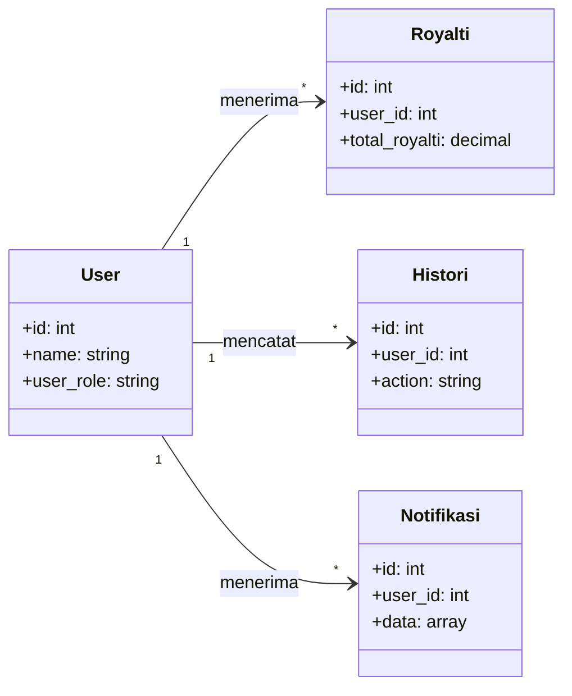
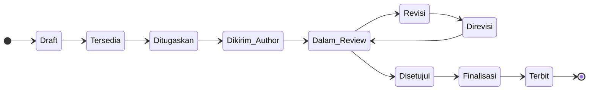

<h1 align="center">SIM Buku Ilmiah</h1>

<p align="center">
  Sistem Informasi Manajemen Penerbitan Buku Ilmiah — alur editorial terstruktur dari hulu ke hilir.
</p>

## Tentang

SIM Buku Ilmiah adalah aplikasi berbasis web untuk mengelola proses penerbitan buku ilmiah dengan alur editorial yang terkontrol. Aplikasi ini mencakup:

- Manajemen user dengan 3 peran: **Admin**, **Author**, **Reviewer**
- Pembuatan buku dan struktur bab
- Assignment author & reviewer ke bab oleh admin (bukan claim mandiri)
- Upload naskah, review, dan revisi
- Finalisasi buku dan katalog
- Produksi dan royalti

## Tech Stack

| Komponen | Teknologi |
|---|---|
| **Backend** | Laravel 11 (PHP ^8.1) |
| **Frontend** | Stisla (Bootstrap Admin Template) |
| **Database** | MySQL |
| **Deployment** | Docker (VPS EC2 AWS) |

## Class Diagram (Modular)

Untuk memudahkan pembacaan dalam laporan, diagram kelas dibagi menjadi tiga modul utama:

### 1. Modul Manajemen Buku & Editorial (Core)
Diagram ini fokus pada struktur buku, bab, dan siklus hidup statusnya.



### 2. Modul Finalisasi & Publikasi
Diagram ini fokus pada proses penggabungan bab menjadi buku final dan penyajian di katalog.



### 3. Modul Monitoring & Keuangan
Diagram ini fokus pada pelacakan aktivitas pengguna dan perhitungan royalti.



### Penjelasan Class Diagram (Untuk Laporan)

Pemisahan diagram di atas bertujuan untuk memperjelas tanggung jawab setiap modul dalam sistem:
1.  **Modul Editorial:** Mengelola data dasar buku dan proses peer-review antar Author dan Reviewer.
2.  **Modul Publikasi:** Mengelola output sistem berupa file buku yang sudah digabung, penomoran ISBN, dan data produksi fisik.
3.  **Modul Monitoring:** Memastikan setiap aksi tercatat dalam log (Histori) dan sistem bagi hasil (Royalti) berjalan transparan bagi penulis.

---

## Alur Editorial (Horizontal)



### Penjelasan Alur Editorial (Untuk Laporan)
Diagram alur di atas menunjukkan transisi status sebuah bab dari pembuatan awal (`Draft`) hingga publikasi (`Terbit`). Arah horizontal ini memudahkan pembaca untuk melihat progres linier dari tahap penugasan hingga tahap finalisasi tanpa memakan banyak ruang vertikal dalam dokumen Word.

---

## Tips Ekspor untuk Word (Laporan Akhir)

Agar diagram terlihat tajam dan profesional di Microsoft Word:

1.  **Gunakan Format SVG:** Di Draw.io, pilih **File > Export As > SVG**. Format ini tidak akan pecah meski Anda memperbesar gambar di Word.
2.  **Atur Resolusi (PNG):** Jika harus menggunakan PNG, saat ekspor setel **DPI/Resolution** ke **300 DPI** atau **Zoom** ke **200-300%**.
3.  **Padding:** Berikan sedikit padding (misal: 10-20 px) saat ekspor agar diagram tidak menempel ke tepi bingkai gambar.


### Urutan Proses

| Langkah | Aksi | Pelaku | Status Baru |
|---|---|---|---|
| 1 | Membuat buku & struktur bab | Admin | — |
| 2 | Membuat bab baru | Admin | `Draft` → `Tersedia` |
| 3 | Assign author & reviewer | Admin | `Ditugaskan` |
| 4 | Upload naskah bab | Author | `Dikirim Author` |
| 5 | Upload review & catatan | Reviewer | `Dalam Review` |
| 6a | Minta revisi | Reviewer | `Revisi` |
| 6b | Upload revisi | Author | `Direvisi` → kembali ke #5 |
| 7 | Setujui bab | Reviewer/Admin | `Disetujui` |
| 8 | Merge & finalisasi buku | Admin | `Finalisasi` |
| 9 | Publikasi katalog | Admin/System | `Terbit` |

## Role & Hak Akses

### Admin

| Area | Akses |
|---|---|
| **User** | CRUD semua user |
| **Buku** | CRUD buku, struktur bab |
| **Assignment** | Assign author & reviewer ke bab |
| **Review** | Lihat semua buku, bab, file, catatan, histori |
| **Finalisasi** | Merge bab (jika semua sudah Disetujui), upload ISBN/cover/final |
| **Katalog** | Buat katalog setelah finalisasi |
| **Produksi** | Buat data produksi |
| **Royalti** | Buat perhitungan royalti |

### Author

| Area | Akses |
|---|---|
| **Buku & Bab** | Lihat hanya yang ditugaskan kepadanya |
| **Upload** | Upload naskah bab untuk tugasnya sendiri |
| **Revisi** | Upload revisi jika status meminta revisi |
| **Catatan** | Lihat catatan reviewer untuk babnya |
| **Larangan** | Tidak bisa claim bab sendiri, tidak bisa upload untuk author lain |

### Reviewer

| Area | Akses |
|---|---|
| **Buku & Bab** | Lihat hanya yang ditugaskan kepadanya |
| **Download** | Unduh naskah bab yang sudah dikirim author |
| **Review** | Upload file review, isi catatan, beri keputusan |
| **Keputusan** | `Revisi` atau `Direkomendasikan Disetujui` |
| **Larangan** | Tidak bisa review bab yang tidak ditugaskan, tidak ubah author/struktur |

## Prasyarat

- PHP ^8.1
- Composer
- MySQL
- Node.js & NPM

## Instalasi

```bash
git clone https://github.com/dioproject/SIM_BUKU_ILMIAH.git
cd SIM_BUKU_ILMIAH
composer install
npm install
cp .env.example .env
php artisan key:generate
php artisan migrate --seed
php artisan serve
```

## Testing

```bash
php artisan test
```

## Aturan Commit

Commit message singkat dan jelas, misalnya:

- `Refactor chapter workflow to admin assignments`
- `Add editorial status workflow`
- `Restrict reviewer access to assigned chapters`
- `Validate chapter finalization readiness`

## Lisensi

[MIT](LICENSE)
