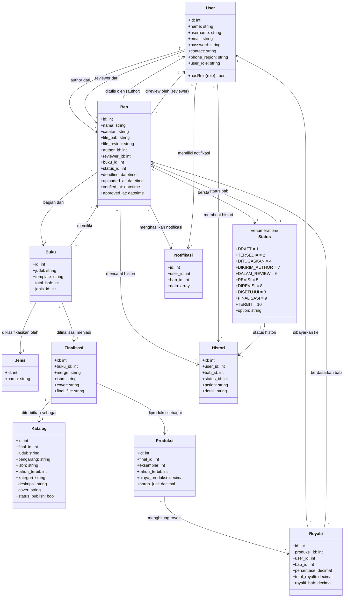
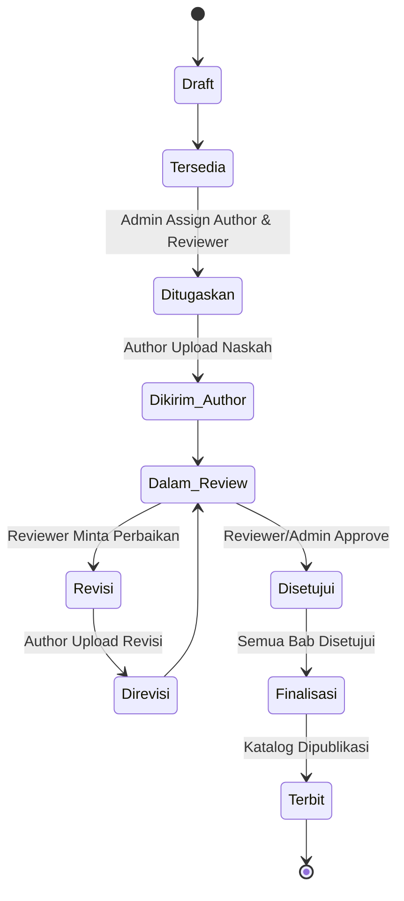

<h1 align="center">SIM Buku Ilmiah</h1>

<p align="center">
  Sistem Informasi Manajemen Penerbitan Buku Ilmiah — alur editorial terstruktur dari hulu ke hilir.
</p>

## Tentang

SIM Buku Ilmiah adalah aplikasi berbasis web untuk mengelola proses penerbitan buku ilmiah dengan alur editorial yang terkontrol. Aplikasi ini mencakup:

- Manajemen user dengan 3 peran: **Admin**, **Author**, **Reviewer**
- Pembuatan buku dan struktur bab
- Assignment author & reviewer ke bab oleh admin (bukan claim mandiri)
- Upload naskah, review, dan revisi
- Finalisasi buku dan katalog
- Produksi dan royalti

## Tech Stack

| Komponen | Teknologi |
|---|---|
| **Backend** | Laravel 11 (PHP ^8.1) |
| **Frontend** | Stisla (Bootstrap Admin Template) |
| **Database** | MySQL |
| **Deployment** | Docker (VPS EC2 AWS) |

## Class Diagram



### Penjelasan Class Diagram (Untuk Laporan)

Diagram di atas menggambarkan arsitektur data sistem SIM Buku Ilmiah yang berpusat pada entitas **Bab** sebagai unit kerja utama. Berikut adalah komponen-komponen utamanya:

1.  **Entitas Inti (Core Entities):**
    -   **User:** Menyimpan data pengguna dengan peran (Admin, Author, Reviewer). Relasi ke Bab menunjukkan tanggung jawab sebagai penulis atau peninjau.
    -   **Buku:** Kontainer utama yang memiliki banyak Bab dan satu jenis kategori.
    -   **Bab:** Entitas paling krusial yang menyimpan file naskah, file review, catatan, dan melacak status editorial dari awal hingga disetujui.
2.  **Manajemen Status:**
    -   **Status:** Menggunakan sistem enumerasi untuk mendefinisikan siklus hidup bab (Draft, Tersedia, Ditugaskan, Review, dsb).
3.  **Finalisasi & Pasca-Produksi:**
    -   **Finalisasi:** Menggabungkan bab-bab yang telah disetujui menjadi satu file final dengan tambahan ISBN dan cover.
    -   **Katalog & Produksi:** Mengelola metadata untuk konsumsi publik (katalog) dan perhitungan biaya serta eksemplar (produksi).
    -   **Royalti:** Menghitung bagi hasil secara otomatis berdasarkan kontribusi per bab dari setiap Author.
4.  **Logging & Monitoring:**
    -   **Histori & Notifikasi:** Mencatat setiap perubahan status dan mengirimkan pemberitahuan kepada pengguna terkait (misal: Author mendapat notifikasi saat Reviewer meminta revisi).

---

## Alur Editorial

### Status Transitions



### Penjelasan Alur Editorial (Untuk Laporan)

Alur editorial pada SIM Buku Ilmiah dirancang untuk memastikan kualitas naskah melalui proses *peer-review* yang ketat:

1.  **Tahap Persiapan:** Buku dibuat oleh Admin, status bab dimulai dari `Draft` kemudian menjadi `Tersedia` untuk diproses.
2.  **Tahap Penugasan:** Admin menentukan siapa Author dan Reviewer untuk tiap bab. Bab berpindah ke status `Ditugaskan`.
3.  **Tahap Pengerjaan:** Author mengunggah naskah awal (`Dikirim Author`).
4.  **Tahap Peninjauan (Review):** Reviewer memeriksa naskah. Di sini terdapat *looping* jika diperlukan perbaikan: `Dalam Review` -> `Revisi` -> `Direvisi` -> kembali ke `Dalam Review`.
5.  **Tahap Kelulusan:** Setelah naskah sesuai standar, status diubah menjadi `Disetujui`.
6.  **Tahap Akhir:** Jika seluruh bab dalam satu buku telah disetujui, Admin melakukan `Finalisasi` (penggabungan file) dan akhirnya buku dinyatakan `Terbit`.

---

## Panduan Konversi ke Draw.io

Untuk memasukkan diagram di atas ke dalam Draw.io (Diagrams.net), ikuti langkah-langkah berikut:

1.  Buka **[app.diagrams.net](https://app.diagrams.net/)**.
2.  Pilih **Insert** (ikon `+` di toolbar atas) atau buka menu **Arrange** > **Insert**.
3.  Pilih **Advanced** > **Mermaid...**.
4.  Salin kode Mermaid (yang berada di dalam blok ` ```mermaid `) dari README ini.
5.  Tempelkan kode tersebut ke dalam kotak teks yang muncul.
6.  Klik **Insert**.
7.  Diagram akan otomatis terbuat dalam format Draw.io yang bisa Anda edit warnanya, bentuknya, atau tata letaknya.

---


### Urutan Proses

| Langkah | Aksi | Pelaku | Status Baru |
|---|---|---|---|
| 1 | Membuat buku & struktur bab | Admin | — |
| 2 | Membuat bab baru | Admin | `Draft` → `Tersedia` |
| 3 | Assign author & reviewer | Admin | `Ditugaskan` |
| 4 | Upload naskah bab | Author | `Dikirim Author` |
| 5 | Upload review & catatan | Reviewer | `Dalam Review` |
| 6a | Minta revisi | Reviewer | `Revisi` |
| 6b | Upload revisi | Author | `Direvisi` → kembali ke #5 |
| 7 | Setujui bab | Reviewer/Admin | `Disetujui` |
| 8 | Merge & finalisasi buku | Admin | `Finalisasi` |
| 9 | Publikasi katalog | Admin/System | `Terbit` |

## Role & Hak Akses

### Admin

| Area | Akses |
|---|---|
| **User** | CRUD semua user |
| **Buku** | CRUD buku, struktur bab |
| **Assignment** | Assign author & reviewer ke bab |
| **Review** | Lihat semua buku, bab, file, catatan, histori |
| **Finalisasi** | Merge bab (jika semua sudah Disetujui), upload ISBN/cover/final |
| **Katalog** | Buat katalog setelah finalisasi |
| **Produksi** | Buat data produksi |
| **Royalti** | Buat perhitungan royalti |

### Author

| Area | Akses |
|---|---|
| **Buku & Bab** | Lihat hanya yang ditugaskan kepadanya |
| **Upload** | Upload naskah bab untuk tugasnya sendiri |
| **Revisi** | Upload revisi jika status meminta revisi |
| **Catatan** | Lihat catatan reviewer untuk babnya |
| **Larangan** | Tidak bisa claim bab sendiri, tidak bisa upload untuk author lain |

### Reviewer

| Area | Akses |
|---|---|
| **Buku & Bab** | Lihat hanya yang ditugaskan kepadanya |
| **Download** | Unduh naskah bab yang sudah dikirim author |
| **Review** | Upload file review, isi catatan, beri keputusan |
| **Keputusan** | `Revisi` atau `Direkomendasikan Disetujui` |
| **Larangan** | Tidak bisa review bab yang tidak ditugaskan, tidak ubah author/struktur |

## Prasyarat

- PHP ^8.1
- Composer
- MySQL
- Node.js & NPM

## Instalasi

```bash
git clone https://github.com/dioproject/SIM_BUKU_ILMIAH.git
cd SIM_BUKU_ILMIAH
composer install
npm install
cp .env.example .env
php artisan key:generate
php artisan migrate --seed
php artisan serve
```

## Testing

```bash
php artisan test
```

## Aturan Commit

Commit message singkat dan jelas, misalnya:

- `Refactor chapter workflow to admin assignments`
- `Add editorial status workflow`
- `Restrict reviewer access to assigned chapters`
- `Validate chapter finalization readiness`

## Lisensi

[MIT](LICENSE)
